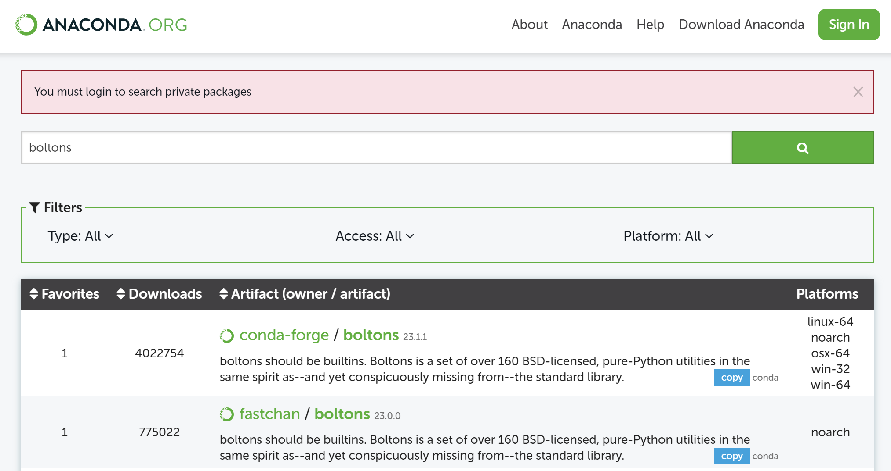

# Entorno de Trabajo para Ciencia de Datos con Jupyter Notebooks

## Ambientes Virtuales

¿Qué es un ambiente virtual? Es un entorno de trabajo aislado del sistema operativo que permite instalar paquetes y librerías sin afectar el funcionamiento de otros programas.

Cada proyecto puede tener su propio ambiente virtual, con sus propias versiones de paquetes y librerías. Esto permite que un proyecto no se vea afectado por cambios en otros proyectos.

## Instalar Conda (Anaconda) a través de la terminal en WSL

Conda es un gestor de paquetes y ambientes virtuales. Anaconda es una distribución de Python que incluye Conda, Jupyter Notebooks y muchas librerías y paquetes de Python. Conda no es exclusivo de Python, también puede instalar paquetes de R, Ruby, Lua, Scala, Java, JavaScript, C/ C++, FORTRAN y más.

Nos dirigimos al sitio web de [Anaconda](https://www.anaconda.com/download). Buscamos la versión de Linux y copiamos el link de descarga. En la terminal de WSL escribimos:

```bash
wget -O anaconda.sh https://repo.anaconda.com/archive/Anaconda3-2019.10-Linux-x86_64.sh
```

esto descargará el archivo de instalación de Anaconda en la carpeta actual con el nombre `anaconda.sh`. Ahora ejecutamos el archivo de instalación:

```bash
bash anaconda.sh
```

Seguimos las instrucciones de instalación. Al finalizar la instalación, cerramos la terminal y la volvemos a abrir, para que los cambios surtan efecto.

Podemos verificar que la instalación fue exitosa escribiendo en la terminal:

```bash
conda --version
```

## Conda: Crear y Actualizar Ambientes Virtuales

### Listar ambientes virtuales

Para listar los ambientes virtuales, escribimos en la terminal:

```bash
conda env list
```

### Crear un ambiente virtual

Para crear un ambiente virtual, escribimos en la terminal:

```bash
conda create --name nombre_ambiente
```

Si quiero paquetes específicos (con versiones específicas inclusive), escribo:

```bash
conda create --name nombre_ambiente paquete1 paquete2=1.8
```

### Activar y desactivar un ambiente virtual

Para activar el ambiente virtual, escribimos en la terminal:

```bash
conda activate nombre_ambiente
```

Para desactivar el ambiente virtual, escribimos en la terminal:

```bash
conda deactivate
```

### Versiones de Paquetes en un Ambiente Virtual

Para verificar las versiones de los paquetes instalados en el ambiente virtual, escribimos en la terminal:

```bash
conda list
```

En ocasiones los ambientes son grandes, si quiero filtrar por un paquete específico, escribo:

```bash
conda list paquete
```

Si queremos actualizar el paquete, escribimos en la terminal:

```bash
conda update paquete
```

Pero actualizará según la versión de Python que tengamos instalada. Si el paquete no es compatible no podrá resolver el ambiente y dará detalles de dicho error (dependencias no resueltas).

### Clone un Ambiente Virtual

Para clonar un ambiente virtual, escribimos en la terminal:

```bash
conda create --name nombre_nuevo_ambiente --copy --clone nombre_ambiente_a_clonar
```

## Conda: Eliminar Ambientes y Paquetes

Para eliminar un paquete, dentro del ambiente, escribimos en la terminal:

```bash
conda remove paquete
```

Para eliminar un ambiente virtual, escribimos en la terminal:

```bash
conda env remove --name nombre_ambiente
```

No se puede remover un ambiente virtual si está activo. Si el ambiente está activo, primero debe desactivarse (para volver al base).

## Conda: Comandos Avanzados

### Crear Ambiente Virtual con Versión de Python Específica

Para crear un ambiente virtual con una versión específica de Python, escribimos en la terminal:

```bash
conda create --name py39 python=3.9 pandas=1.2
```

### Instalar Paquetes desde Canales Adicionales

Ahora bien, imagina que quieres instalar un paquete que no está en la lista de conda. Puedes buscar canales adicionales desde www.anaconda.org.



En la imagen, he buscado el paquete "boltons" y he encontrado que está en el canal "conda-forge" para distintas plataformas. Para instalarlo, escribimos en la terminal:

```bash
conda install --channel conda-forge boltons
```

y listo, el paquete "boltons" se instalará en el ambiente virtual. para verificarlo, escribimos:

```bash
conda list
```

### Revisiones de Ambientes Virtuales

Podemos revisar el estado de un ambiente virtual en un momento específico. Cada vez que se instala o actualiza un paquete, se crea una revisión del ambiente virtual.

Para revisar las revisiones de un ambiente virtual, escribimos en la terminal:

```bash
conda list --revisions
```

La revisión detallará los paquetes instalados y las versiones de los mismos. Si queremos volver a una revisión específica, escribimos:

```bash
conda install --revision 0
```

La revisión 0 es la revisión inicial, es decir, el ambiente recién creado. Esto creará una nueva revisión con los paquetes de la revisión 0.

### Exportar Ambientes Virtuales

Para exportar un ambiente virtual, escribimos en la terminal

* --no-builds: asegura que se exporte solo el nombre y la versión del paquete.
* --from-history: solo incluirá los paquetes que fueron instalados por el usuario.

```bash
conda env export --no-builds --from-history --file environment.yml
```

### Importar Ambientes Virtuales

Para importar un ambiente virtual, escribimos en la terminal:

```bash
conda env create --file environment.yml
```

## Acelerar la Creación de Ambientes Virtuales con Mamba

Mamba es un gestor de paquetes y ambientes virtuales que acelera la creación de ambientes virtuales. Mamba es compatible con Conda, es decir, podemos usar los comandos de Conda con Mamba.

Mamba es una reimplementación de Conda en C++, lo que lo hace más rápido que Conda. Para instalar Mamba, escribimos en la terminal:

```bash
conda install --channel conda-forge mamba
```

Para ver los comando de Mamba, escribimos en la terminal:

```bash
mamba --help
```

Podemos crear un ambiente virtual con Mamba desde un archivo `environment.yml` con el comando:

```bash
mamba env create --file environment.yml
```

## Bonus: Divide y Vencerás

Divide y vencerás es una técnica de diseño de algoritmos que consiste en resolver un problema dividiéndolo en subproblemas más simples de resolver. La idea es que si los subproblemas son lo suficientemente pequeños, se resuelven de manera sencilla. Una vez resueltos los subproblemas, se combinan para resolver el problema original.

En el caso de ambientes virtuales, podríamos tener un proyecto con muchos paquetes y librerías, pero no necesitamos todos los paquetes y librerías para trabajar en el proyecto. Podríamos dividir el proyecto en subproyectos (por ejemplo, Externos, Modelo y Comunicación) y crear un ambiente virtual para cada subproyecto.

Así en nuestra carpeta del proyecto se tendrán, por ejemplo, tres archivos `environment.yml` con los paquetes y librerías necesarios para cada subproyecto.

Existen herramientas como Snakemake que permiten dividir un proyecto en subproyectos y gestionar los ambientes virtuales de cada subproyecto.
